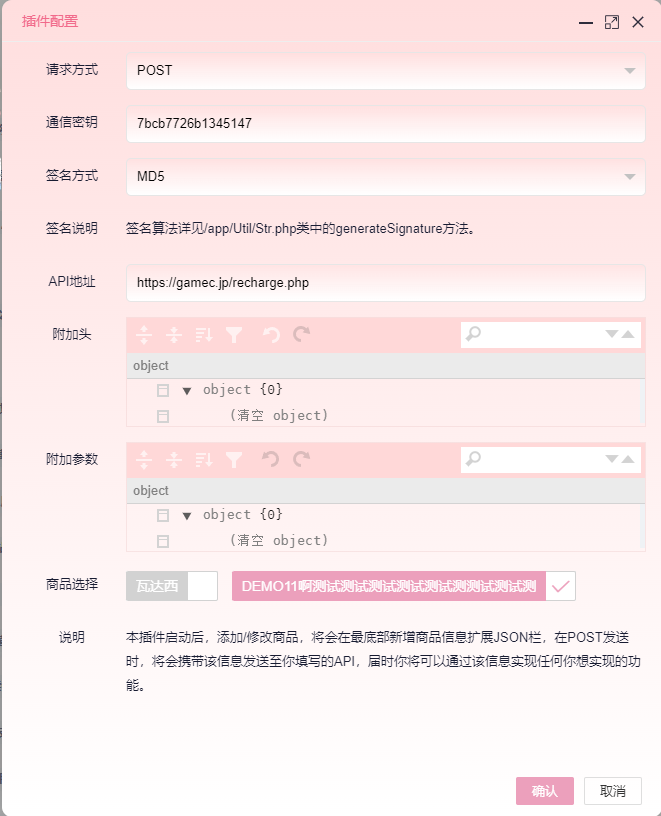
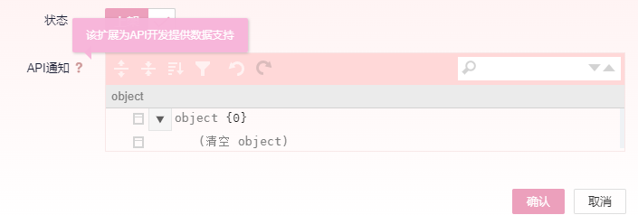
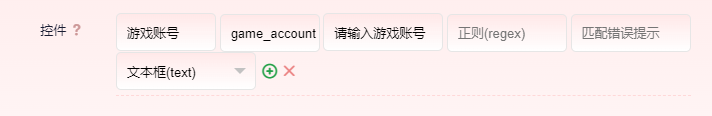
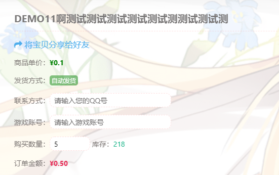
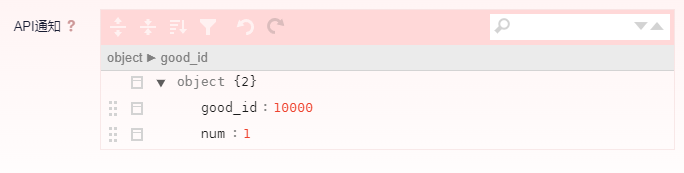
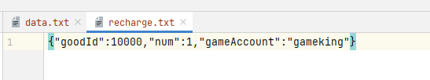
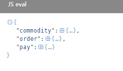

### 插件介绍

> 或许你是不知道什么原因下载本插件，又或许你抱着充满期待下载本插件，那么API通知插件到底是什么原理或者说他又能做什么呢？
>
> 好吧，那我们举几个例子。
>
> 众所周知，我们经常玩的游戏，以及上网流量的论坛，又或者是一些收费EXE软件，这些项目中，都会有一些内购商品，比如游戏里面玩家的装备、时装，或者论坛里面的VIP会员和EXE软件的电脑授权。
>
> 在以前我们要实现这些，最快的解决方案就是各种卡密，各种CDK来进行兑换和充值，其中操作极其繁琐。
>
> 那么现在这个插件，就是为了解决这些烦恼而诞生的一种在线充值的快速解决方案，你仅仅只需要提供一个充值到账的API接口。

### 配置插件

API地址就是用户下单前台商品，并且支付成功后系统会请求的地址，这里值得注意的是《商品选择》，这个选项，只有勾选上的商品，才会进行数据回调，否则会自动忽略。



保存后，我们就配置完毕了。

### 配置商品

当然，插件配置完成后，我们`启动插件`，然后打开`商品管理`，找到我们要配置的商品，然后拉到最下面，我们可以看到多了一个`API通知`的选项，这里配置的信息作为商品附加信息，方便我们实现想要实现的功能。



### 小试牛刀
#### 1.实现游戏道具在线购买即时到账

我们先在商品中配置我们需要的数据：

- 玩家的游戏账号
- 发送给玩家的道具物品的ID
- 发送给玩家的道具数量

1.首先，我们需要配置`玩家的游戏账号`，我们通过`控件`功能进行配置，让玩家在前台购买的适合可以输入他的游戏账号。

   


2.然后我们配置要发送的游戏道具ID和道具数量，我们通过`API通知`选项来进行配置。



3.编写我们的`recharge.php`游戏充值接口，这个接口是在你的游戏服务器上的，你可以使用任何语言开发，这里我就使用php进行演示。

```php
<?php
$appKey = "7bcb7726b1345147"; //插件的APPKEY
$data = json_decode((string)$_POST['data'], true); //数据包

//验证签名
function generateSignature(array $data, $appKey): string
{
    unset($data['sign']);
    ksort($data);
    foreach ($data as $key => $val) {
        if ($val === '') {
            unset($data[$key]);
        }
    }
    return md5(urldecode(http_build_query($data) . "&key=" . (string)$appKey));
}

//这里签名验证仅仅是作为演示，当然你如果有自己的验证方式，可以不采取这种验证
//但是安全还是要做好，推荐使用这种方式进行验证
if (generateSignature($_POST, $appKey) != $_POST['sign']) {
    exit("sign error");
}


//拿到整个商品信息，这里的商品信息和店铺数据库表_commodity字段一致，包含了商品所有你想取的信息
$commodity = $data['commodity'];
//拿我们自定义的 游戏道具ID和要发送道具的数量
$extend = json_decode($commodity['extend'], true);
//游戏道具ID
$goodId = $extend['good_id'];
//数量
$num = $extend['num'];

//现在去拿整个订单信息，也是同样和数据库表_order字段一致，包含了订单任何你想取到的信息
$order = $data['order'];
//拿到玩家在前台下单的游戏账号
$widget = json_decode($order['widget'], true);
//玩家账号
$gameAccount = $widget['game_account']['value'];


//拿到所有信息，进行物品发送，这里大家脑补一下代码，
//验证订单信息..
//验证玩家是否存在..
//物品发送..
//发送站内信到账通知..
//充值成功

//我这里就进行txt写出到日志，方便大家学习
file_put_contents("./recharge.txt", json_encode([
    "goodId" => $goodId,
    "num" => $num,
    "gameAccount" => $gameAccount
], JSON_UNESCAPED_UNICODE | JSON_UNESCAPED_SLASHES));

//将整个data数据写出，让你看看里面到底是什么，或许你能在这里面找到你想要的东西
file_put_contents("./data.txt", json_encode($data, JSON_UNESCAPED_UNICODE | JSON_UNESCAPED_SLASHES));

//返回成功状态
exit("success");
```
这是我服务器接受到的数据：



data.txt：

